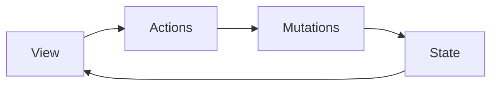

# Introduction

- Strong-typed accessor based on [MobX](https://mobx.js.org/).
- Framework agnostic, easily integrated with React, Vue, or any other framework.

:point_right: [Get Started](./getting-started)

## Why?

MobX is a powerful library that makes state management simple. It is written in pure JavaScript with no compiler magic or framework binding, making it a great library to separate the state from the view, thus allowing us to easy reuse or migrate our logic between different projects even with different tech stack.

Redux on the other side, provides great concepts which standardize how we manipulate the state. But it is a pain to write the redux template code.

*MobX Accessor* brings the concepts of Redux to MobX while the code remains neat. *MobX Accessor* is to MobX as [Typed Vuex][typed-vuex] is to Vue observable.

## Concepts

*MobX Accessor* has 4 concepts:

- `State`: holds the actual data
- `Mutations`: are the only way to modify `state`
- `Getters`: derive values from `state` and other `getters`
- `Actions`: connect the logic with the data

:point_right: [Get Started](./getting-started)

## Credits

This project is heavily inspired by [Typed Vuex][typed-vuex].

The APIs are quite similar, so we can easily share logic or migrate between Vuex projects and projects using `mobx-accessor` with any framework.

[typed-vuex]: https://github.com/danielroe/typed-vuex
